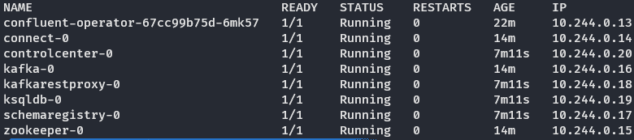
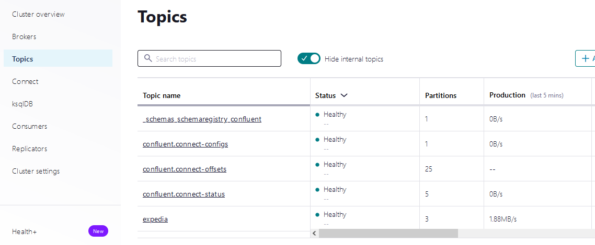
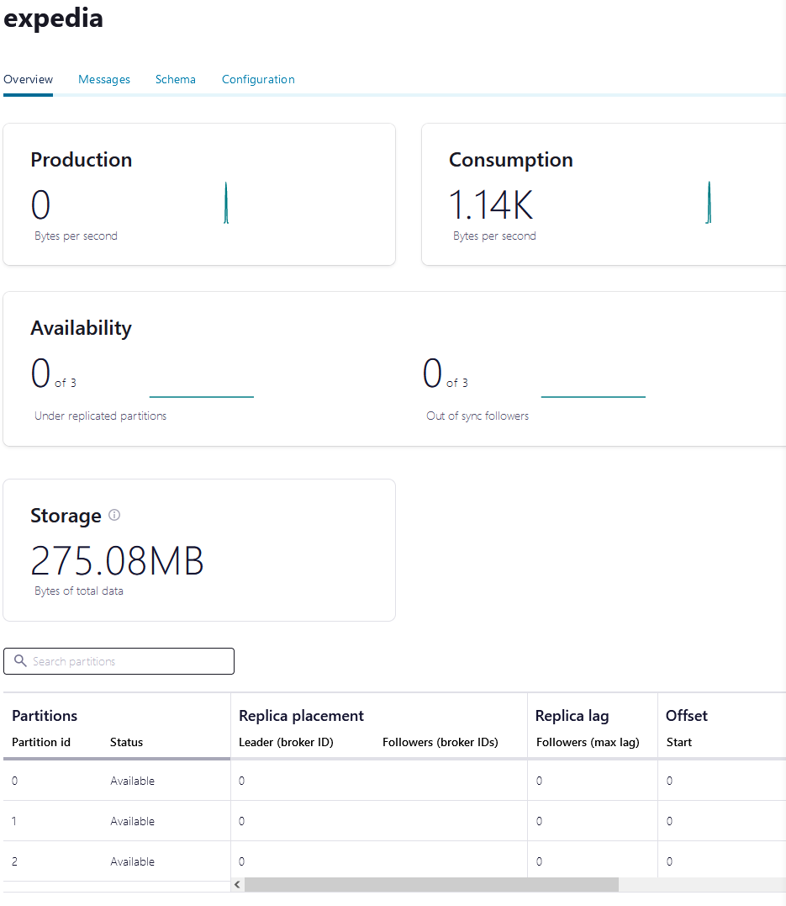

> **⚠ This guide assumes that all commands are executed from the repository root, if not stated otherwise**

# Prerequisites

You'll need the following to get started with the application:
1. [Docker](https://www.docker.com/)
2. [Kubernetes CLI](https://kubernetes.io/docs/tasks/tools/#kubectl)
3. [Helm](https://helm.sh/docs/intro/install/)
4. [Terraform CLI](https://developer.hashicorp.com/terraform/tutorials/azure-get-started/install-cli)
5. [Azure CLI](https://learn.microsoft.com/en-us/cli/azure/install-azure-cli-linux?pivots=apt)
6. Bash-compatible environment, such as WSL
7. Azure account with active subscription

# Prepare Azure infrastructure

1. Make `create-azure-env.sh` script executable. To do this, run
    ```sh
    chmod +x create-azure-env.sh
    ```

2. Run the script:
    ```sh
    ./create-azure-env.sh
    ```

    During the execution, the script will ask for 3 inputs:
    1. Azure region: name of Azure location to create all of the resources, including Terraform state
    2. Prefix for the resources: unique prefix which will be prepended to the names of the resources created by this script
    3. Prior to creating the infrastructure, Terraform will ask you if you want to apply it. Please type "`yes`":
        ```
        Do you want to perform these actions?
            Terraform will perform the actions described above.
            Only 'yes' will be accepted to approve.

            Enter a value: yes
        ```
3. Upload the "expedia" dataset to storage container provisioned as part of the infrastucture

# Deploy Confluent stack

1. Make `deploy-to-aks.sh` script executable. To do this, run
    ```sh
    chmod +x deploy-to-aks.sh
    ```

2. Run the script:
    ```sh
    ./deploy-to-aks.sh
    ```

# Monitor the deployment

Before creating the source connector, you need to make sure that the resources are running properly:
1. Run
    ```sh
    kubectl --kubeconfig=kubeconfig get pods -o wide
    ```
2. Check the status. You should have all 8 pods in "Running" state:
    

# Deploy the connector

1. Set port forwarding for the Kafka Connect pod:
    ```sh
    kubectl --kubeconfig=kubeconfig port-forward connect-0 8083:8083
    ```

2. Make `deploy-connector.sh` script executable. To do this, run
    ```sh
    chmod +x deploy-connector.sh
    ```

3. Run the script:
    ```sh
    ./deploy-connector.sh
    ```

# Check the results

1. Set port forwarding for the Control Center pod
    ```sh
    kubectl --kubeconfig=kubeconfig port-forward controlcenter-0 9021:9021
    ```
2. Open the Control Center web console: http://localhost:9021

3. Navigate to "Topics" page:
    

4. Open "expedia" topic to inspect its contents:
    

5. Now proceed to the "Messages" tab of the page. By adjusting timeframe or offset you can inspect messages in a chosen partition:
    
